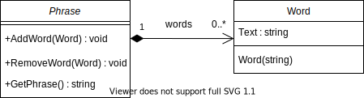

[Conceptos de Programación Orientada a Objetos](../../)


# 0. Objetos, Clases y Mensajes

## 0.3 Desarrollo

Es tradición que el primer programa en cualquier lenguaje sea uno cuyo propósito consiste en imprimir en la consola el mensaje `¡Hola mundo!`. Fieles a esa tradición haremos ese programa a nuestra manera.

El programa que aparece a continuación se encuentra en muchos textos sobre C# pero no es realmente orientado a objetos. Creamos el programa en Visual Studio Code con el [comando](https://github.com/ucudal/PII_Comandos) `dotnet new console` y lo ejecutamos desde allí.

```c#
using System;

namespace HelloWorld
{
    public class Program
    {
        static void Main(string[] args)
        {
            Console.WriteLine("¡Hola mundo!");
        }
    }
}
```

> ⚠️  **Nota**: <br/>La declaración `namespace` permite definir un espacio de nombres para los tipos definidos en el archivo de código fuente; es conveniente definir un espacio de nombres, pero no es obligatorio; en el código de los ejemplos que aparecen aquí -y que puedes descargar de GitHub- usamos espacios de nombres, pero en este documento lo omitimos por simplicidad.
>
>La declaración del método de clase `Main` incluye los argumentos que se reciben en el programa de consola desde el sistema operativo; aquí los omitimos porque no los vamos a usar.

Aunque este programa imprime en la consola `"¡Hola Mundo!"`, no nos permite ver cómo es un programa orientado a objetos, pues no usa clases ni crea objetos como ocurre en un programa orientado a objetos<sup>6</sup>.

<br/>

Hemos dicho que en un programa orientado a objetos los datos y la lógica del programa están distribuidas en forma razonablemente equilibrada entre un conjunto de objetos que colaboran solicitándose y prestándose servicios mediante el envío de mensajes. Vamos a cambiar el programa anterior para que aparezcan algunas clases y objetos de esas clases. El programa esencialmente escribe una frase con palabras. Deberíamos tener además de la clase para el programa, una clase para las palabras -en inglés "words"-, y otra para las frases -en inglés "phrase"-. Las palabras deben conocer su texto, y las frases deben conocer sus palabras, y armar el texto de la frase a partir del texto de las palabras.

Para mostrar las clases y sus responsabilidades vamos a utilizar primero "tarjetas" con tres secciones:

<table id="card">
    <tr>
        <td align="center" colspan="2">
            <p>&nbsp;</p>
        </td>
    </tr>
    <tr>
        <td>
            <p>&nbsp;</p>
        </td>
        <td>
            <p>&nbsp;</p>
        </td>
    </tr>
</table>


En la sección de arriba va el nombre de la clase, en la sección de abajo a la izquierda va la lista de responsabilidades de hacer y conocer de esa clase, y en la sección de abajo a la derecha va la lista de clases que colabora con esta para cumplir esas responsabilidades.

Estas "tarjetas" se llaman CRC por "clases", "responsabilidades" y "colaboraciones".

<br>

Creemos la tarjeta para la clase `Word` con la que representamos las palabras, y la responsabilidad de conocer el texto de las palabras:

<table id="card">
    <tr>
        <td align="center" colspan="2">
            <p><b>Word</b></p>
        </td>
    </tr>
    <tr>
        <td>
            <p>Conocer el texto de la palabra</p>
        </td>
        <td>
            <p>&nbsp;</p>
        </td>
    </tr>
</table>

Convertimos la información de la "tarjeta" a código C# así:

```c#
using System;

public class Word
{
    private string text;

    public Word(string text)
    {
        this.Text = text;
    }

    public string Text
    {
        get
        {
            return this.text;
        }
        set
        {
            this.text = value.Trim();
        }
    }
}
```
> [Ver en repositorio »](https://github.com/ucudal/PII_WordsPhrases_v1/blob/master/src/Library/Word.cs)

La clase `Word` tiene una propiedad `Text` de lectura y escritura para implementar la responsabilidad de conocer el texto de la palabra. También tiene un constructor `Word(string)` que recibe una `string` como argumento, que se asigna a la propiedad `Text`. Noten el uso de `Trim()` para que el texto de la palabra no tenga espacios. Como todas las clases tienen un constructor predeterminado, omitimos el constuctor como responsabilidad de la clase. Al escribir un constructor que permite asignar el texto inicial de la palabra, ya no tenemos posibilidad de usar el constructor predeterminado, lo cual es bueno porque no va a ser posible tener palabras sin texto, es decir, no posible crear instancias de `Word` con la propiedad `Text` vacía.

<br>

Las tarjetas CRC son una forma simple y efectiva de representar clases, responsabilidades y colaboraciones, pero hay otras formas de mostrar nuestas clases y objetos: los diagramas [UML](https://www.omg.org/UML/). En particular, los [diagramas de clase](https://en.wikipedia.org/wiki/Class_diagram) UML.

Una clase se representa en UML mediante un rectángulo. Al igual que en las tarjetas CRC, hay tres secciones en el rectángulo, pero apiladas, una encima de la otra. En la primera sección aparece el nombre de la clase, debajo todas las propiedades, y luego todos los métodos.

El diagrama de la clase `Word` queda así:


El símbolo `+` delante de los miembros -propiedades, variables de instancia, métodos, etc.- indica que el miembro es público. Las propiedades y variables de instancia aparecen con el nombre primero y el tipo después, separados por el símbolo `:`. Los métodos aparece con el nombre primero, los tipos de los parámetros después, separados por los símbolos `(` y `)`, y el tipo al final, separado por el símbolo `:`.

<br>

Creemos también la tarjeta para la clase `Phrase` con la que representamos las frases, y la responsabilidad de conocer las palabras, y las responsabilidades de agregar y quitar palabras, así como de armar el texto de la frase a partir del texto de las palabras:

<table id="card">
    <tr>
        <td align="center" colspan="2">
            <p><b>Phrase</b></p>
        </td>
    </tr>
    <tr>
        <td>
            <p>Conocer las palabras de la frase</p>
            <p>Agregar palabras a la frase</p>
            <p>Quitar palabras a la frase</p>
            <p>Armar el texto de la frase</p>
        </td>
        <td>
            <p>Word</p>
        </td>
    </tr>
</table>

A diferencia de la clase `Word` que no tenía otras clases que colaboraran con ella, ella sí colabora con `Phrase`, porque `Phrase` necesita de la clase `Word` para cumplir con sus propias responsabilidades.

Programamos la "tarjeta" de la clase `Phrase` de esta forama:


```c#
using System.Collections;
using System.Text;

public class Phrase
{
    private ArrayList words;

    public Phrase()
    {
        this.words = new ArrayList();
    }

    public void AddWord(Word word)
    {
        this.words.Add(word);
    }

    public void RemoveWord(Word word)
    {
        this.words.Remove(word);
    }

    public string GetPhrase()
    {
        StringBuilder phrase = new StringBuilder();

        foreach (Word word in this.words)
        {
            phrase.Append(" ");
            phrase.Append(word.Text);
        }

        string result = phrase.ToString();
        result = result.TrimStart();

        return result;
    }
}
```

> [Ver en repositorio »](https://github.com/ucudal/PII_WordsPhrases_v1/blob/master/src/Library/Phrase.cs)

<br>

Como una instancia de la clase `Phrase` tiene la responsabilidad de conocer mútiples instancias de la clase `Word` -noten que la responsabilidad es "conocer las palabras", no solo "una palabra"-, necesitamos implementar esa responsabilidad de conocer mediante un contenedor, también llamado [colección](https://docs.microsoft.com/es-es/dotnet/csharp/programming-guide/concepts/collections). Un contenedor o colección es una clase capaz de contener múltiples instancias de otra. En este caso usamos como contenedor una instancia de la clase `ArrayList` que se crea en el constructor `Phrase()` y se asigna a la variable de instancia `words` cuando se ejecuta el constructor.

La responsabilidad de agregar palabras a la frase se implementa en el método `AddWord(Word)` y la de remover palabras de la frase en el método `RemoveWord(Word)`. Por último, la responsabilidad de armar el texto de la frase se implementa en el método `string GetPhrase()`.

<br>

El diagrama de la clase `Phrase` queda así:


La sección debajo del nombre de la clase aparece en blanco porque `Phrase` no tiene atributos públicos. Los tres métodos de esa clase aparecen debajo.

Podemos representar también a la relación entre `Phrase` y `Word` mediante una línea que va de `Phrase` a `Word`. Del lado de `Phrase` la línea tiene un rombo, lo que significa que las instancias de `Phrase` **están compuestas por** instancais de `Word`; como la flecha va en un solo sentido, significa que `Word` no conoce a `Phrase`. Como una instancia de `Phrase` está compuesta de 0 o muchas instacias de `Word`, la flecla tiene un `1` del lado de `Phrase` y un `*` del lado de `Word`. La palabra `word` sobre la flecha indica el nombre con el cual `Phrase` referencia a `Word`.



<br>

Vamos a crear también una tarjeta para la clase `Program`, que será la clase que cree el saludo `"¡Hola Mundo!"` usando las clases `Word` y `Phrase`, es decir, `Word` y `Phrase` colaboran con `Program`.

<table id="card">
    <tr>
        <td align="center" colspan="2">
            <p><b>Program</b></p>
        </td>
    </tr>
    <tr>
        <td>
            <p>Crear e imprimir un saludo</p>
        </td>
        <td>
            <p>Word</p>
            <p>Phrase</p>
        </td>
    </tr>
</table>

Los cambios que introducimos en la nueva versión de programa nos permiten mostrarles cómo colaboran un conjunto de objetos para hacer lo mismo que la versión original. Convertimos el texto `"¡Hola Mundo!"` en un objeto de la clase `Phrase` que contiene un conjunto de objetos de la clase `Word`.

```c#
public class Program
{
    public static void Main()
    {
        Word hello = new Word("Hola");
        Word world = new Word("Mundo!");
        Phrase greeting = new Phrase();

        greeting.AddWord(hello);
        greeting.AddWord(world);

        Console.WriteLine(greeting.GetPhrase());
    }
}
```

> [Ver en repositorio »](https://github.com/ucudal/PII_WordsPhrases_v1/blob/master/src/Program/Program.cs)

Esta nueva versión del programa declara dos variables locales del tipo `Word` llamadas `hello` y `world`. Luego crea dos objetos de la clase `Word` que son almacenados en esas variables. Las palabras deben tener un texto, por lo cual los constructores reciben los textos `"Hola"` y `"mundo"` respectivamente como argumento.

Luego el programa declara una variable de tipo `Phrase` llamada `greeting`. Luego crea un objeto de la clase `Phrase` que es almacenado en esa variable. El programa luego envía mensajes con selector `AddWord` al objeto referenciado en la variable `greeting` pasando como argumento de los mensajes los objetos de tipo `Word` creados anteriormente.

Por último, el programa envía un mensaje con selector `GetPhrase` a ese mismo objeto, y el resultado se imprime en la consola.

<br>

El diagrama completo en UML quedaría así:


Las líneas punteadas representa que `Program` depende de `Phrase` y de `Word` pero nada más, la referencias a esas clases son simples variables definidas localmente en el método `void Main()`. Este método aparece subrajayado porque es un método estático.

<br>

> [0.4 Patrones y Principios »](./0_4_Patrones_Principios.md)

<br/>

------------

_<sup>6</sup> Esto es parcialmente cierto. El código declara una clase `Program`; sin embargo, la clase `Program` no es usada por nosotros, sino por el entorno en tiempo de ejecución -runtime environment-. El código también crea un objeto de `String` mediante el literal `Hola mundo`; sin embargo, ningún mensaje es enviado a ese objeto._
