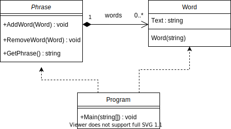

[Conceptos de Programación Orientada a Objetos](../../)


# 1. Objetos, Clases y Mensajes

## 1.2 Pasando conceptos a código

Ahora vamos a ver cómo se implementan en un lenguaje de programación los conceptos que definimos en el capítulo anterior. En este curso vamos a utilizar un lenguaje llamado C# -que se pronuncia "si yarp"-.

Repasamos la definición de clase:

> **Clase**
>
> Una **clase** es una **plantilla** o **molde** para un conjunto de objetos que comparten los mismos atributos, métodos, relaciones y semántica.

Veamos por ejemplo cómo declaramos una [clase](https://docs.microsoft.com/es-es/dotnet/csharp/language-reference/keywords/class) `Person` en C# para representar personas:

```c#
public class Person
{
}
```

La palabra clave `public` indica que la clase es visible para todas las demás clases y objetos. Le llamamos "palabra clave" a una palabra que tiene un significado especial en el lenguaje. La palabra clave `class` indica que a continuación aparece la definición de una clase, que es el código que está entre los corchetes `{`  y `}`. La palabra `Person` es el nombre de la clase. No es una palabra clave, sino un indentificador.

Como los objetos representan "cosas", los nombres de las clases son siempre sustantivos. Por [convención](https://docs.microsoft.com/es-es/dotnet/standard/design-guidelines/capitalization-conventions), utilizamos para los nombres de clases una combinación de mayúsculas y minúsculas llamada "Pascal case": una combinación de palabras sin espacios en la que la letra inicial de cada palabra va en mayúsculas; por ejemplo, `PascalCase`.

Aunque no lo hayamos programado, en C# todas las clases tienen un [constructor](https://docs.microsoft.com/es-es/dotnet/csharp/programming-guide/classes-and-structs/using-constructors) predeterminado. Recordemos qué es el constructor:

> **Constructor**
>
> El **constructor** es un método de clase para **crear** e **inicializar** nuevas instancias de esa clase.

Como la clase se llama `Person`, en C# el constructor predeterminado es `Person()`, un método de clase especial cuyo nombre coincide con el nombre de la clase, y no tiene argumentos.

Recordemos qué es un objeto:

> **Objeto**
>
> Un **objeto** es una instancia de una clase.

En C# creamos objetos de la siguiente forma:

```c#
new Person();
```

La palabra clave `new` seguida del constructor de la clase [crea un objeto](https://docs.microsoft.com/es-es/dotnet/csharp/language-reference/operators/new-operator) de esa clase.

Tal como está definida, por ahora, esta clase `Person` no tiene estado ni comportamiento.

Recordemos las definiciones de atributo y de estado:

> **Atributo**
>
> Cada dato que un objeto conoce es un **atributo**.

> **Estado**
>
> El **estado** de un objeto son los **datos** y los **valores** de los datos que el objeto **conoce** y están almacenados en los **atributos**.

Digamos que nuestra clase `Person` tiene la responsabilidad de conocer el nombre y el apellido de una persona. La clase debería tener un atributo para representar el nombre -en inglés "name"- y otro para representar el apellido -en inglés "family name"-:

```c#
public class Person
{
    private string name;
    private string familyName;
}
```

Ahora la clase `Person` tiene un atributo `name` y otro `familyName`; ambos son de tipo `String`, es decir, [cadenas de caracteres](https://docs.microsoft.com/es-es/dotnet/csharp/programming-guide/strings/) -en C# es necesario declarar el tipo de los atributos-. Los atributos se declaran dentro de la definición de la clase, es decir, dentro de los corchetes `{`  y `}` que siguen a `class Person`.

> ❓ ¿Por qué se escribe `string name` con `string` en minúscula y luego dice que el tipo es `String` con mayúscula?
>
> Con minúscula `string` es una palabra clave del lenguaje, un alias para la clase `String` con mayúscula. Al usar la palabra clave `string` se evita tener que indicar dónde está definida la clase `String` agregando el espacio de nombres `System`.

Esta forma de declarar atributos en C# es mediante [variables de instancia](https://docs.microsoft.com/es-es/dotnet/csharp/language-reference/language-specification/variables#instance-variables). En la declaración anterior de la clase `Person`, `name` es una variable de instancia [privada](https://docs.microsoft.com/es-es/dotnet/csharp/language-reference/keywords/private) de tipo `string`, y `familyName` es otra variable de instancia también privada del mismo tipo. Veremos más adelante que esta no es la única forma de declarar atributos en C#.

Repasemos la definición de encapsulacion:

> **Encapsulación**
>
> La **encapsulación** es el resultado de ocultar todos los detalles acerca de la implementación de las responsabilidades.

La palabra clave `private` en la declaración de los atributos indica que el atributo es accesible sólo por objetos de la propia clase en la que se define; es decir, el detalle de cómo se implementan las responsabilidades de conocer el nombre y el apellido de las personas está oculto.

La clase `Person` debería permitir obtener y cambiar el nombre y el apellido de la personas. Estas son responsabilidades de hacer o comportamiento. Recordemos la definición de comportamiento:

> **Comportamiento**
>
> Cada objeto puede tener la **responsabilidad** de hacer una parte de la lógica del programa. El **comportamiento** de un objeto son las cosas que el objeto **hace** y está implementado en los **métodos**.

Agreguemos entonces a la clase `Person` los [métodos](https://docs.microsoft.com/es-es/dotnet/csharp/programming-guide/classes-and-structs/methods) que implementan las responsabilidades de obtener el nombre -en inglés "get name"-, cambiar el nombre -en inglés "set name"-, etc.:

```c#
public class Person
{
    private string name;
    private string familyName;
    public string GetName()
    {
        return this.name;
    }
    public void SetName(string value)
    {
        this.name = value;
    }
    public string GetFamilyName()
    {
        return this.familyName;
    }
    public void SetFamilyName(string value)
    {
        this.familyName = value;
    }

}
```

> [Ver en repositorio »](https://github.com/ucudal/PII_Person/blob/main/v1/src/Library/Person.cs)

La palabra clave `string` en `string GetName()` indica que el método retorna una cadena de caracteres -en C# es necesario declarar el tipo del resultado de los métodos-; el identificador `GetName` es el nombre del método; los paréntesis `()` indican que el método no tiene parámetros. Llamaremos "firma de un método" al conjunto de resultado, nombre y parámetros de un método.

La implementación del método es el código que está entre los corchetes `{`  y `}` que siguen a la firma del método. En este caso la implementación consiste de la palabra clave `return`, que indica que el método [retorna](https://docs.microsoft.com/es-es/dotnet/csharp/language-reference/keywords/return) la expresión que está a continuación, seguida de `this.name` que indica la variable de instancia `name` del objeto que está ejecutando el método; nos referimos al [objeto que está ejecutando](https://docs.microsoft.com/es-es/dotnet/csharp/language-reference/keywords/this) el método con la palabra clave `this`.

Como los métodos representan "acciones", los nombres de los métodos contienen siempre verbos —acciones— o verbos y sustantivos —acciones sobre elementos—.

La palabra clave `void` en `void SetName(string value)` indica que el método no retorna [ningún valor](https://docs.microsoft.com/es-es/dotnet/csharp/language-reference/builtin-types/void); el identificador `SetName` es el nombre del método; este método tiene un [parámetro](https://docs.microsoft.com/es-es/dotnet/csharp/programming-guide/classes-and-structs/passing-parameters) llamado `value` de tipo `string` que va entre los paréntesis `()` que siguen al nombre del método -en C# es necesario declarar el tipo de los parámetros-. En este caso la implementación de ese método consiste en asignar el valor a la variable de instancia `name` del objeto que está ejecutando el método, con el valor del parámetro `value`, mediante el operador `=`.

> :warning: El operador `=` no se lee "igual" sino "asignar", y sirve para "copiar" el valor que está a la derecha a la variable que está a la izquierda.

Vean que todos los métodos en este ejemplo están declarados con la palabra clave `public`, para que otros objetos puedan conocer y cambiar el nombre y apellido de las personas. La forma como eso sucede, es decir, el detalle de implementación de los métodos, es desconocido para los objetos de otras clases, por eso decimos que está encapsulado.

Cuando otro objeto desea crear una persona y darle un nombre, debe hacer lo siguiente:

```c#
public static void Main()
{
    Person lucho;
    lucho = new Person();
    lucho.SetName("Luis");
    lucho.SetFamilyName("Suárez");
}
```

> [Ver en repositorio »](https://github.com/ucudal/PII_Person/blob/main/v1/src/Program/Program.cs)

El ejemplo anterior define un método de clase de nombre `AssignVariableWithObject`, sólo a efectos de poder mostrar como ejemplo la creación de un objeto de la clase `Person`.

En este ejemplo la sentencia `Person lucho` define una [variable](https://docs.microsoft.com/es-es/dotnet/csharp/language-reference/language-specification/variables#local-variables) llamada `lucho` capaz de contener instancias de la clase `Person`.

La variable en este momento está vacía, no tiene ningún objeto y su valor es `null`. Como vimos antes, `null` es una palabra clave en C#, que se usa para indicar que no hay ningún objeto asignado a una variable.

La sentencia que está a la derecha del signo `=` en la sentencia `lucho = new Person()` crea una nueva instancia de la clase Word mediante el constructor predeterminado. Cuando usamos este constructor las variables de instancia `name` y `familyName` tienen el valor `null`.

Luego enviamos al objeto en la variable `lucho` el mensaje con selector `SetName("Luis")`. Esto hace que se ejecute el método de nombre `SetName` que vimos antes, pasándole como parámetro el valor `"Luis"`. Como resultado de la ejecución de ese método, según analizamos antes, se asignará a la variable de instancia `name` del objeto contenido en `lucho` el valor `"Luis"`. Algo análogo ocurre con el mensaje con selector `SetFamilyName("Suárez")`, que hará que se ejecute el método de nombre `SetFamilyName` con el parámetro `"Suárez"`, que como resultado asignará el valor del parámetro a la variable de instancia `FamilyName` del objeto contenido en `lucho`.

Como es muy común que los atributos se implementen mediante variables de instancia privadas y métodos públicos que permiten obtener y cambiar sus valores, C# provee un mecanismo simplificado llamado [propiedades](https://docs.microsoft.com/es-es/dotnet/csharp/programming-guide/classes-and-structs/properties). Veamos como queda la declaración de la clase `Person` utilizando propiedades en lugar de variables de instancia:

```c#
public class Person
{
    private string name;
    private string familyName;
    public string Name { get { return this.name; } set { this.name = value; } }
    public string FamilyName { get { return this.familyName; }  set { this.familyName = value; } }
    ...
}
```

> [Ver en repositorio »](https://github.com/ucudal/PII_Person/blob/main/v2/src/Library/Person.cs)

Esta forma de declarar los atributos para el nombre y el apellido de la persona es equivalente a la anterior. Ahora la clase `Person` tiene un atributo `Name` y otro `FamilyName`; ambos son de tipo `String`. Las propiedades se declaran dentro de la definición de la clase, es decir, dentro de los corchetes `{`  y `}` que siguen a `class Person`, al igual que las variables de instancia.

La diferencia es que la implementación de los métodos de la versión anterior ahora está contenida dentro de los corchetes `{`  y `}` que siguen a las palabras claves `get` y `set`. A estas implementaciones les llamamos coloquialmente "getters" y "setters", aunque esas palabras no existen en español.

El fragmento de código que vimos antes para crear una persona y darle un nombre quedaría ahora así:

```c#
public static void Main()
{
    Person lucho;
    lucho = new Person();
    lucho.Name = "Luis";
    lucho.FamilyName = "Suárez";
}
```

> [Ver en repositorio »](https://github.com/ucudal/PII_Person/blob/main/v2/src/Program/Program.cs)

Aunque `lucho.Name = "Luis"` parezca la asignación de un valor a una variable de instancia, en realidad se termina ejecutando en tiempo de ejecución el código en el "setter" de la propiedad `Name`, es decir, el código de la cláusula `set` de esa propidad, o sea `this.name = value`. En esta expresión `value` es una palabra reservada que referencia al objeto que se está asignado a la propiedad, en este caso, la instancia de la clase `String` con valor `"Luis"`.

De esta forma podemos utilizar las propiedades de forma equivalente a como usaríamos variables de instancia, pero la forma como se obtiene o modifica el valor de esas variables de instancia, está encapsulada en los "getters" y los "setters" cuya implementación es interna a la clase, al igual que la variables de instancia privada, sólo se puede obtener y cambiar su valor a través esas implementaciones.

Como es muy frecuente que los "getters" y los "setters" obtengan y modifiquen valores de variables de instancias privadas, en versiones más recientes de C# apareció una forma resumida de declarar las propiedades, donde se omite la variable de instancia, y también la implementación de los "getters" y los "setters":

```c#
public class Person
{
    public string Name { get; set; }
    public string FamilyName { get; set; }
    ...
}
```

> [Ver en repositorio »](https://github.com/ucudal/PII_Person/blob/main/v3/src/Library/Person.cs)

Desde el punto de vista del código que usa la clase `Person`, esta versión es exactamente igual a la anterior, por lo que el método de clase `AssignVariableWithObject` debería seguir funcionando exactamente igual que antes.

```c#
public static void Main()
{
    Person lucho;
    lucho = new Person();
    lucho.Name = "Luis";
    lucho.FamilyName = "Suárez";
}
```

> [Ver en repositorio »](https://github.com/ucudal/PII_Person/blob/main/v2/src/Program/Program.cs)

## ¿Dónde "viven" los objetos?

Para poder enviar un mensaje a un objeto, tenemos que poder tener acceso a ese objeto. Vimos antes en el ejemplo cómo tener acceso a un objeto mediante la variable local `lucho`, pero hay otras formas:

- **Literales**: En varios lenguajes de programación, incluyendo C#, es posible tener acceso a un objeto mediante un literal. En los ejemplos anteriores, `"Luis"` es una instancia de la clase `String`. `42`, `0x2A`, o `0b_0010_1010` son ejemplos de literales de la clase `Int32`, en notación decimal, hexadecimal, y binaria respectivamente. `true` y `false` son literales de la clase `Boolean`. `'j'`, `'\u006A'` o `\x006A'` son ejemplos de literales de la clase `Char` en notación ASCII, como secuencia de escape Unicode y como secuencia de escape hexadecimal respectivamente.

- **Variables de instancia**: Hemos visto que el estado de un objeto se representa en variables de instancia, o en el caso de C# en propiedades. Por ejemplo, `private string name` en la clase `Person` anterior, es una variable de instancia de la clase `String`.

- **Variables locales**: En cualquier bloque de código, ya sea el cuerpo de un método, o el de estructura de control de flujo `if`, `for`, `foreach`, etc. es posible declarar variables locales a ese bloque; esto quiere decir que la variable sólo se puede usar dentro del bloque. En el ejemplo anterior, `Person lucho` declara una variable llamada `lucho` de tipo `Person`. Es posible declarar e inicializar una variable en la misma línea de código, escribiendo `Person lucho = new Person()`.

- **Variables de clase**: A diferencia de las variables de instancia, que representan el estado de un objeto, las variables de clase está asociadas a la propia clase y, por lo tanto, su valor es el mismo para todas las instancias de esa clase. Las variables de clase se declaran en C# con la palabra clase `static` antes de la declaración de la variable.

- **Parámetros**: Los métodos pueden recibir parámetros, como en el ejemplo `void SetFamilyName(string value)`; allí, el método de nombre `SetFamilyName` recibe un parámetro de tipo `String` y nombre `value`. El objeto que envíe un mensaje para que se ejecute ese método deberá proveer un objeto de tipo `String` para ese parámetro cuando envíe el mensaje.

Todas las variables y parámetros tienen un valor predeterminado, a menos que asignemos uno diferente. El valor depende del tipo de la variable. En los casos donde el tipo es una clase declarada por nosotros, como `Person`, el valor predeterminado de una variable de ese tipo es `null`. En otros casos, el valor predeterminado puede obtenerse con `defaut()`. Pueden ver más detalles [aquí](https://learn.microsoft.com/es-es/dotnet/csharp/language-reference/builtin-types/default-values).

## ¿Cuánto viven los objetos?

Excepto por los objetos literales, los demás deben crearse con la palabra clave `new`. Con esa palabra clave se invoca el constructor de la clase, que crea una nueva instancia de esa clase.

En la clase `Person` que usamos hasta ahora, el constructor predeterminado permite crear instancias de personas sin nombre ni apellido. Para evitar eso tenemos que crear un constructor que nos pida como parámetro el valor inicial del nombre y del apellido. Cuando definimos un constructor, el constructor predeterminado deja de existir, y sólo podemos utilizar el que definimos, con lo que logramos que todas las personas tengan un nombre y un apellido en el momento de ser creados.

Definimos un nuevo constructor así:

```c#
public class Person
{
    public Person(string name, string familyName)
    {
        this.Name = name;
        this.FamilyName = familyName;
    }
    ...
}
```

> [Ver en repositorio »](https://github.com/ucudal/PII_Person/blob/main/v4/src/Library/Person.cs)

<br>

Para crear objetos de la clase `Person` ahora tenemos que usar el nuevo constructor, el método de clase `Main` que veníamos usando quedaría así:

```c#
public static void Main()
{
    Person lucho;
    lucho = new Person("Luis", "Suárez");
}
```

> [Ver en repositorio »](https://github.com/ucudal/PII_Person/blob/main/v4/src/Program/Program.cs)

<br/>

La variable `lucho` se define cuando se comienza a ejecutar el método `Main` y ocupa espacio suficiente en el **stack** de la memoria como para contener la dirección de memoria que fue asignada al objeto `Person`. Por su lado ese objeto ocupa espacio en la memoria **heap** de tamaño suficiente como para contener las propiedades `Name` y `FamilyName`.

Ese objeto recién creado se asigna a la variable `lucho` que está a la izquierda del signo `=`. El signo `=` no se lee como “igual”, sino como “asignar”. Para comparar si dos variables apuntan al mismo objeto el signo es `==`, como veremos más adelante.

La variable `lucho` referencia o apunta al objeto creado. Para acceder al valor de la propiedad `FullName` usamos `lucho.FullName`. Por ejemplo, `Console.WriteLine(lucho.FullName)` imprimirá en la consola `"Luis Suárez"`, que es el resultado de concatenar los valores con los que inicializamos las propiedades `Name` y `FamilyName` al crear el objeto.

Como la variable `lucho` es una variable local definida dentro del método de clase `Main` de la clase `Program`, tan pronto como finalice la ejecución de ese método la variable `lucho` deja de ser accesible, es decir, no va a ser posible enviar mensajes o acceder a las propiedades del objeto contenido o referenciado en esa variable. En ese momento, el objeto se destruye<sup>1</sup>.

Es posible destruir el objeto antes. Por ejemplo, si hacemos `lucho = null`, estamos asignando nuevamente el valor `null` a la variable `lucho`. Tampoco vamos a poder enviar mensajes o acceder a las propiedades del objeto que habíamos creado a partir de ese momento usando la variable `lucho`, por lo tanto, el objeto se destruye.

Veamos otro ejemplo cuando más de una variable apunta al mismo objeto.

``` c#
public static void AssignTwoVariablesWithObject()
{
    Person colo;
    colo = new Person("Juan Ignacio", "Ramírez");
    Console.WriteLine(colo.FullName); // Se imprime "Juan Ignacio Ramírez"

    Person goleador;
    goleador = colo;
    Console.WriteLine(goleador.FullName); // Se imprime "Juan Ignacio Ramírez"

    Console.WriteLine($"¿Las dos variables apuntan al mismo objeto? {colo == goleador}"); // Se imprime "true"
}
```

> [Ver en repositorio »](https://github.com/ucudal/PII_Person/blob/main/v5/src/Program/Program.cs#L41-L52)

El código es similar al anterior. Además de la variable `colo` de tipo `Person` se define una variable `goleador` también de tipo `Person`. En la sentencia `goleador = colo` a esa variable `goleador` se le asigna el objeto referenciado en `colo`. Hay un solo objeto, el que se creó con `new Person("Juan Ignacio", "Ramírez")`, pero dos variables apuntan a él.

Esto puede verse claramente cuando accedemos a la propiedad `FullName` del objeto referenciado en la variable `colo` con `colo.FullName` y luego accedemos a la misma propiedad del objeto referenciado en la variable `goleador`: cuando imprimimos el valor de esa propiedad con `Console.WriteLine(goleador.FullName)` aparece `"Juan"` en la consola, a pesar de que enviamos el mensaje al objeto en la variable `goleador` y accedemos a la propiedad del objeto creado en la variable `colo`. Ambas variables apuntan al mismo objeto.

Una forma de comprobar esto es comparando los objetos referenciados por esas variables con el operador `==`. Por ejemplo, al ejecutar `Console.WriteLine($"¿Las dos variables apuntan al mismo objeto? {colo == goleador}")` se imprimirá `True` en la consola.

Veamos ahora este otro ejemplo.

``` c#
public static void CompareEqualObjects()
{
    Person chino;
    chino = new Person("Sergio", "Rochet");
    Console.WriteLine(chino.FullName);

    Person arquero;
    arquero = new Person("Sergio", "Rochet");
    Console.WriteLine(arquero.FullName);

    Console.WriteLine($"¿Las dos variables apuntan al mismo objeto? {chino == arquero}");
    Console.WriteLine($"¿Los dos objetos son iguales? {chino.Equals(arquero)}");
}
```

> [Ver en repositorio »](https://github.com/ucudal/PII_Person/blob/main/v5/src/Program/Program.cs#L73-L85)

El ejemplo crea dos objetos `new Person("Sergio", "Rochet")` y los asigna a las variables `chino` y `arquero` respectivamente. Aunque ambos objetos son iguales, porque en ambos casos la propiedad `Name` contiene el valor `"Sergio"` y la propiedad `"FamilyName"` contiene el valor `"Rochet"`, al ejecutar `Console.WriteLine($"¿Las dos variables apuntan al mismo objeto? {chino == arquero}")` se imprimirá `False` en la consola. Esto es porque los objetos referenciados por ambas variables son diferentes, son objetos distintos, cada uno ocupando un espacio diferente en el **heap** de la memoria.

También se imprimirá `False` en la consola al ejecutar `Console.WriteLine($"¿Los dos objetos son iguales? {chino.Equals(arquero)}")`. Aunque conceptualmente estemos hablado de la misma persona, para C# son dos objetos diferentes.

> ⚠️  **Nota**: <br/>
> Si quisiéramos que el método `Equals(object?)` y el operador `==` retornen `True` cuando las propiedades de dos objetos diferentes son iguales, es necesario sobrescribir el método `Equals(object?)` y el operador `==` en la clase de ese objeto. Vamos a ver qué es sobrescribir un método más adelante.
>
> El código de la clase `Person` en el [repo](https://github.com/ucudal/PII_Person/blob/main/v5/src/Program/Program.cs#L48-L104) tiene implementados esos métodos pero están comentados. Quita los comentarios y ejecuta el programa para que puedas ver las diferencias.

Veamos ahora que pasa con los parámetros de los métodos. Los parámetros de los métodos se comportan en forma análoga a las variables que declaramos dentro de los métodos: sólo pueden ser usados dentro del método.

Cuando pasamos un objeto como parámetro a un método, en realidad estamos pasando la dirección de memoria del objeto. Vean el siguiente ejemplo:

``` c#

public static void CreateObject()
{
    Person artillero = new Person("Luis", "Artime");
    Console.WriteLine($"Antes de cambiar el nombre: {artillero.FullName}");
    UseObject(artillero);
    Console.WriteLine($"Después de cambiar el nombre: {artillero.FullName}");
}

private static void UseObject(Person person)
{
    person.FamilyName = "Ganador de Copas";
}
```

> [Ver en repositorio »](https://github.com/ucudal/PII_Person/blob/main/v5/src/Program/Program.cs#L90-L101)

En el método `CreateObject()` se crea una instancia de la clase `Person`, que se pasa como parámetro al método `UseObject(Person)`. En el método `UseObject(person)` no se puede acceder a la variable `artillero` declarada en el méotodo `CreateObjects()`, pero sí se puede acceder al objeto que se asignó a esa variable, a través del parámetro `person`. Por ejemplo, se puede cambiar la propiedad `FamilyName` asignado el valor `"Ganador de Copas"`. La variable `artillero` y el parámetro `person` apuntan al mismo objeto. Esto puede comprobarse al imprimir en la consola `Console.WriteLine($"Después de cambiar el nombre: {artillero.FullName}")`: aparece `"Luis Ganador de Copas"` que fue el valor asignado en `UseObject(person)` con `person.FamilyName = "Ganador de Copas"`.

El espacio en la memoria del **stack** para el parámetro `person` se asigna cuando se llama al método `UseObject(person)` y se libera cuando el método termina.

## Tarjetas CRC y diagramas de clases

En este curso vamos a mostrar las clases y responsabilidades de los objetos usando una notación de tarjetas con tres secciones:

<table id="card" border="1px solid">
    <tr>
        <td align="center" colspan="2">
            <p>&nbsp;</p>
        </td>
    </tr>
    <tr>
        <td>
            <p>&nbsp;</p>
        </td>
        <td>
            <p>&nbsp;</p>
        </td>
    </tr>
</table>


En la sección de arriba va el nombre de la clase, en la sección de abajo a la izquierda va la lista de responsabilidades de hacer y conocer de esa clase, y en la sección de abajo a la derecha va la lista de clases que colabora con esta para cumplir esas responsabilidades.

Estas "tarjetas" se llaman CRC por "clases", "responsabilidades" y "colaboraciones".

Agreguemos a nuestra clase `Person` la responsabilidad de presentarse a otra persona:

```csharp
public void IntroduceTo(Person person)
{
    if (person != null)
    {
        Console.WriteLine($"Hola, {person.Name}, mi nombre es {this.Name}");
    }
}
```

> [Ver en repositorio »](https://github.com/ucudal/PII_Person/blob/main/v5/src/Library/Person.cs#L55-L61)

<br>

Creemos la tarjeta para la clase `Person` con la que representamos las personas, y la responsabilidades de conocer el nombre, el apellido, y de presentarse:

<table id="card" border="1px solid">
    <tr>
        <td align="center" colspan="2">
            <p><b>Person</b></p>
        </td>
    </tr>
    <tr>
        <td>
            <p>Conocer el nombre</p>
            <p>Conocer el apellido</p>
            <p>Presentarse a otra persona</p>
        </td>
        <td>
            <p>Person</p>
        </td>
    </tr>
</table>

La clase `Person` aparece como colaboradora de sí misma... ¿por qué? Porque la presentarse "a otra persona" necesita pedir algo a la otra persona, en particular, necesita saber su nombre para saludarla. Cuando una clase pide algo a otra, ya sea enviándole un mensaje o accediendo a sus atributos, como es este el caso, se dice que la segunda colabora con la primera.

<br>

Las tarjetas CRC son una forma simple y efectiva de representar clases, responsabilidades y colaboraciones, pero hay otras formas de mostrar nuestas clases y objetos: los diagramas [UML](https://www.omg.org/UML/). En particular, los [diagramas de clase](https://en.wikipedia.org/wiki/Class_diagram) UML.

Una clase se representa en UML mediante un rectángulo. Al igual que en las tarjetas CRC, hay tres secciones en el rectángulo, pero apiladas, una encima de la otra. En la primera sección aparece el nombre de la clase, debajo todos los atributos, y luego todos los métodos.

El diagrama de la clase `Person` queda así:


El símbolo `+` delante de los miembros -propiedades, variables de instancia, métodos, etc.- indica que el miembro es público. Las propiedades y variables de instancia aparecen con el nombre primero y el tipo después, separados por el símbolo `:`. Los métodos aparece con el nombre primero, los tipos de los parámetros después, separados por los símbolos `(` y `)`, y el tipo al final, separado por el símbolo `:` –si existiera, no ocurre en este caso pues el método `IntroduceTo` no retorna ningún valor–.

<br>

Vamos a crear también una tarjeta para la clase `Program`, que es la otra clase que venimos usando en estos ejemplos. La responsabilidad de presentarse a otra persona es usada en `Program` en el método `IntroducePersons()`.

```csharp
public static void IntroducePersons()
        {
            Person lucho = new Person("Luis", "Suárez");
            Person chino = new Person("Sergio", "Rochet");
            chino.IntroduceTo(lucho);
            lucho.IntroduceTo(chino);
        }
```

> [Ver en repositorio »](https://github.com/ucudal/PII_Person/blob/main/v5/src/Program/Program.cs#L102-L108)

<br>

Podemos decir que la clase `Program` tiene la responsabilidad de presentar personas y que en consecuencia la clase `Person` colabora con la clase `Program`. La tarjeta CRC de la clase `Program` quedaría así:


<table id="card" border="1px solid">
    <tr>
        <td align="center" colspan="2">
            <p><b>Program</b></p>
        </td>
    </tr>
    <tr>
        <td>
            <p>Presentar dos personas</p>
        </td>
        <td>
            <p>Person</p>
        </td>
    </tr>
</table>

<br>

El diagrama completo en UML quedaría así:




Las líneas punteadas representa que `Program` depende de `Person` pero nada más, la referencias a esas clases son simples variables definidas localmente en el método `IntroducePersons()`.

> [1.3 Patrones y principios »](./1_3_Patrones_Principios.md)

****

_<sup>1</sup> Esto es parcialmente cierto. El proceso de **garbage collection** no se ejecuta inmediatamente sino cada cierto tiempo cuando se cumplen ciertas condiciones_

