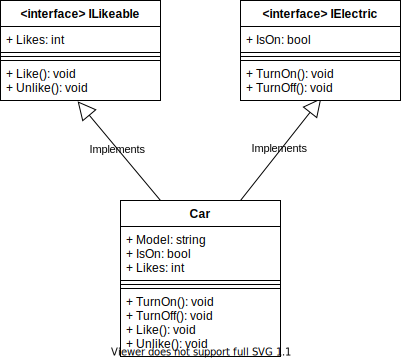

[Conceptos de Programación Orientada a Objetos](../../)


# 2. Tipos

## 2.2 Desarrollo

Los objetos colaboran entre ellos para realizar tareas más complejas de las que pueden realizar por si solos.
Los objetos piden colaboración enviando mensajes, que indican a los objetos que los reciben las tareas que deben realizar. Pero las tareas que un objeto puede realizar son limitadas y numerables.

Me gustan los autos y las canciones, entre otras cosas.

No puedo pedirle la partitura a mi auto favorito<sup>1</sup>. El auto no entendería el mensaje, no sabe qué es una partitura. Además, yo sé qué cosas puedo pedirle a un auto, así que ni siquiera se me ocurría pedírselo, sería improductivo. En cambio, sí podría preguntarle la partitura a mi canción favorita.

Por otro lado, mi auto favorito sí sabe cómo llevarme de un lado a otro. Puedo pedirle que se prenda o se apague. Es algo que yo sé que mi auto puede hacer, porque todos los autos, independientemente del modelo o marca, pueden hacerlo; es parte de la definición de auto llevarme de un lugar a otro, prenderse, o apagarse, es algo que no me sorprende que un auto pueda hacer, si no lo hace ni siquiera lo consideraría un auto.

Hasta ahora vimos dos puntos: por un lado, que yo no le pido a mi auto favorito cosas que sé que no puede hacer, y por otro, que por la propia definición de auto sé qué cosas puede hacer y cómo debo pedírselas. ¿Qué pasaría si cuando a uno compra un auto no sabe que es lo que ese auto hace? Imaginemos que nos compramos un auto y no se prende, ni se apaga, ni me lleva de un lado a otro, sino que me dice su biografía y en qué películas actuó. Obviamente no podríamos usar ese objeto como inicialmente queríamos hacerlo. Compramos un auto para que nos lleve de un lado a otro. En definitiva, ese auto no me sirve de mucho, porque no hace lo que espero que haga. Yo voy a enviar mensajes para prender, por ejemplo, y nunca voy a enviar un mensaje preguntando por la biografía, ¡porque estoy convencido de tener un auto!

Pero esto no es algo que suceda en la vida real, porque en la vida real nombres como “auto” describen tipos de objetos. Cuando decimos que un objeto “es un auto” sabemos que es lo que ese objeto puede o no hacer. Existe una especie de “contrato” que tanto el auto como yo respetamos. El auto me lleva de un lugar a otro, porque en caso contrario no sería un auto, y yo no le pido que me diga su biografía, porque sé que un auto no puede hacerlo. El contrato me permite usar ese auto y realizar tareas más complejas que las que yo podría hacer solo.

En definitiva, si yo no sé qué cosas puedo hacer con un auto, y cómo pedirle que las haga, no puedo hacer uso de él. Saber que un objeto es de tipo “auto” me informa qué puede hacer, y cómo pedírselo.

El tipo define las operaciones que puedo hacer sobre un objeto y como referirme a ellas.

Como vimos antes, me gustan los autos, los actores, pero también las publicaciones de mis amigos y contactos en las redes sociales; son cosas “gustables”. Puedo darle o quitarle “likes” tanto a los autos, como a los actores, como a las publicaciones en redes sociales, y luego puedo preguntar cuántos “likes” tienen.

Por otro lado, puedo apagar y prender el auto, pero también puedo prender y apagar todos los aparatos eléctricos.

A un auto puedo pedirle que me lleve de un lugar a otro y decirle que me gusta; por lo tanto, es auto y es gustable. A su vez, puedo prenderlo y apagarlo; por lo tanto, es un auto y es eléctrico.

Por lo tanto, un objeto puede tener varios tipos, mientras que cumpla el contrato que define cada uno.

Es importante ver que un tipo define a una familia de posibles objetos. Es una especificación, o contrato, de los servicios que un objeto provee, pero no un objeto en sí. Todos los autos en un concesionario son eso, autos; y cada uno de ellos es diferente de los demás, por más que sean todos autos.

¿Cuál es la diferencia con una clase? Si recuerdan el concepto de clase, ésta es una plantilla o molde para un conjunto de objetos. En una clase definimos los distintos mensajes que puede recibir un objeto. Sin embargo, además, definimos el código que va a ejecutarse al recibir cada mensaje, y los atributos de la clase (cuyos valores definen el estado de un objeto instancia de esa clase). Pero en el caso de un tipo, éste solo sirve para especificar qué servicios o mensajes atiende un objeto de ese tipo, pero no da ningún detalle de implementación. Ni cómo va a procesar ese mensaje, ni qué atributos utilizará para manejar su estado. No es algo que nos interese al comprar un auto. Solo pedimos que haga lo que un auto tiene que hacer. Cómo lo hace, en general no solo no lo sabemos, sino que no nos importa. Además, cómo lo hace no es parte de la definición de un auto, depende del fabricante.

Esto tiene como principal consecuencia que no existe el concepto de instancia de un tipo, ya que no es posible crear un objeto a partir de un tipo. ¿Por qué? Debido a que un objeto es una entidad completa, cuyo comportamiento y estado está totalmente definido. Pero un tipo no define comportamiento ni atributos, y por lo tanto no me provee información suficiente para poder construir un objeto de ese tipo. Para poder construir un objeto de tipo A, necesitaría una clase que defina todos los componentes necesarios de mi objeto (comportamiento y atributos) y que los mensajes que pueda recibir coincidan con los del tipo que intento crear. En este caso, la instancia esa clase, obtendría un objeto que responde a los mismos mensajes que el tipo A, y por lo tanto podría considerarlo como del tipo A.

Para concluir, un tipo define los servicios que provee un objeto, es lo que me permite interactuar con el objeto porque es lo que me permite saber que puedo pedirle al mismo y cómo hacerlo. Un tipo difiere de una clase en que no especifica como se procesa el mensaje o se brinda el servicio, ni define que atributos son necesarios para mantener el estado de un objeto de ese tipo.

¿Como funciona todo esto a nivel del lenguaje de programación? Simplemente tenemos que decirle al programa de qué tipo es cada objeto que utilicemos, de forma de indicarle cuáles son las operaciones que podemos realizar sobre el mismo y que mensaje debemos enviarle para utilizarlas. Si enviamos un mensaje que ese tipo no sabe procesar, se generara un error<sup>2</sup>.

Dado que un tipo no es lo mismo que una clase, C# nos provee una construcción particular para tipos, llamada interface, donde se pueden especificar los mensajes que puede recibir un objeto de ese tipo, para acceder a su estado o pedirle que haga algo, pero no la implementación de los métodos ni las variables de instancia que podría necesitar.

Luego, para poder construir objetos de un cierto tipo, necesito tener una clase que implemente a ese tipo, es decir, que defina el comportamiento para cada mensaje o servicio mediante código. C# permite decir que una clase implementa una interfaz simplemente escribiendo al momento de la declaración de la clase el nombre seguido de “:” y luego los nombres de las interfaces separadas por comas. Tal como vimos antes, un objeto puede ser de varios tipos al mismo tiempo, por lo cual una clase también puede implementar tantos tipos como quiera.

> ⚠️  **Nota**: <br/>
> Cuando una clase implementa un tipo declarado mediante la palabra clave **interface**, tiene en realidad dos tipos: el tipo explícito de la declaración y el tipo implícito compuesto por todos los métodos y atributos de esa clase.

A continuación, definiremos los tipos **IElectric** para las cosas que puedo prender y apagar e **ILikeable** para las que me pueden gustar o no, explícitamente como interfaces; también definiremos una clase **Car** que implementará los tipos **IElectric** e **ILikable** y por lo tanto tendrá los tipos **Car**, **IElectric** e **ILikeable** y una clase Actor que implementará el tipo **ILikeable** y por lo tanto tendrá los tipos **Actor** e **ILikeable**.

```c#
using System;

public interface IElectric
{
    Boolean IsOn { get; }
    void TurnOn();
    void TurnOff();
}
```
> [Ver en repositorio »](https://github.com/ucudal/PII_Types/blob/master/src/Library/IElectric.cs)

En UML representamos las interfaces de forma similar a las clases, pero agregando `<interface>` antes del nombre de la interfaz. La representación de la interfaz `IElectric` en UML quedaría así:


</br>

```c#
using System;

public interface ILikeable
{
    Int32 Likes { get; }
    void Like();
    void Unlike();
}
```
> [Ver en repositorio »](https://github.com/ucudal/PII_Types/blob/master/src/Library/ILikeable.cs)

En UML representamos esta otra interfaz así:


</br>

```c#
using System;

public class Car : IElectric, ILikeable
{
    private String model;
    private Boolean isOn;
    private Int32 likes;

    public Car(String model)
    {
        this.model = model;
        this.isOn = false;
        this.likes = 0;
    }

    public String Model
    {
        get
        {
            return this.model;
        }
    }

    public Boolean IsOn
    {
        get
        {
            return this.isOn;
        }
    }

    public Int32 Likes
    {
        get
        {
            return this.likes;
        }
    }

    public void TurnOn()
    {
        this.isOn = true;
    }

    public void TurnOff()
    {
        this.isOn = false;
    }

    public void Like()
    {
        this.likes = this.likes + 1;
    }

    public void Unlike()
    {
        if (this.likes > 0)
        {
            this.likes = this.likes - 1;
        }
    }
}
```
> [Ver en repositorio »](https://github.com/ucudal/PII_Types/blob/master/src/Library/Car.cs)

En UML representamos que la clase `Car` implementa las interfaces `ILikeable` e `IElectric` así:



</br>

```c#
using System;

public class Actor : ILikeable
{
    private String name;
    private Int32 likes;

    public Actor(String name)
    {
        this.name = name;
    }

    public String Name
    {
        get
        {
            return this.name;
        }
    }

    public Int32 Likes
    {
        get
        {
            return this.likes;
        }
    }

    public void Like()
    {
        this.likes = this.likes + 1;
    }

    public void Unlike()
    {
        if (this.likes > 0)
        {
            this.likes = this.likes - 1;
        }
    }
}
```
> [Ver en repositorio »](https://github.com/ucudal/PII_Types/blob/master/src/Library/Actor.cs)

```c#
using System;
public class Program
{
    public static void Main(String[] args)
    {
        ILikeable likeable;
        IElectric electric;
        String model = "Citroen C4 Cactus";

        Car car = new Car(model);
        likeable = car;
        likeable.Like();
        likeable.Like();
        Console.WriteLine("{0} tiene {1} me gusta", model, car.Likes);

        electric = car;
        electric.TurnOn();
        Console.WriteLine("{0} está prendido: {1}", model, electric.IsOn);

        String name = "John Travolta";
        Actor actor = new Actor(name);
        actor.Like();
        actor.Unlike();
        Console.WriteLine("{0} tiene {1} me gusta", name, actor.Likes);
    }
}
```
> [Ver en repositorio »](https://github.com/ucudal/PII_Types/blob/master/src/Program/Program.cs)

Una instancia de **Actor** comparte el tipo **ILikeable** con una instancia de **Car**, pero no el tipo **IElectric** ni **Car**. Sin embargo, debido a que el tipo define un contrato entre un cliente y un servidor, sería posible que un cliente del tipo **ILikeable** utilizará un **Car** como un Actor de forma indistinta, ya que ambos cumplen el contrato definido por el tipo **ILikeable**.

Por ejemplo, puedo crear una página web que permita dar y quitar :+1: a un **ILikeable** cualquiera y luego usarlo para mostrar instancias de **Car** o de **Actor** en forma indistinta, ya que ambas son instancias de tipo **ILikeable**.

Esta es una aplicación del principio de sustitución anunciado anteriormente. El principio fue enunciado por Bárbara Liskov en estos términos:

<details open>
<summary>🗒 Tarjeta: Principio de sustitución en la redacción de Liskov ±</summary>

| Principio de sustitución en la redacción de Liskov |
| ---- |
| Si para cada objeto O de tipo S existe un objeto O' de tipo T tal que para todos los programas P definidos en términos de T, el comportamiento de P permanece sin cambios cuando O es substituido por O', entonces S es un subtipo de T. |

</details>
<br/>

En nuestro caso, T sería **ILikeable**, y los subtipos S serían **Car** y **Actor**.

<br>

> [2.3 Lecturas Sugeridas »](./2_3_Lecturas_Sugeridas.md)

</br>

****

_<sup>1</sup> Este ejemplo es artificiosamente disparatado. Al principio no va a sonar bien, pero al final veremos porqué lo hemos elegido.  Paciencia por favor._

_<sup>2</sup> Este comportamiento existe siempre, tanto a nivel de lenguajes fuertemente como débilmente tipeados. La diferencia es que el chequeo de tipos se hace en tiempo de compilación o en tiempo de ejecución, respectivamente. C# es un lenguaje fuertemente tipeado._
